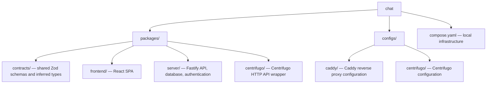
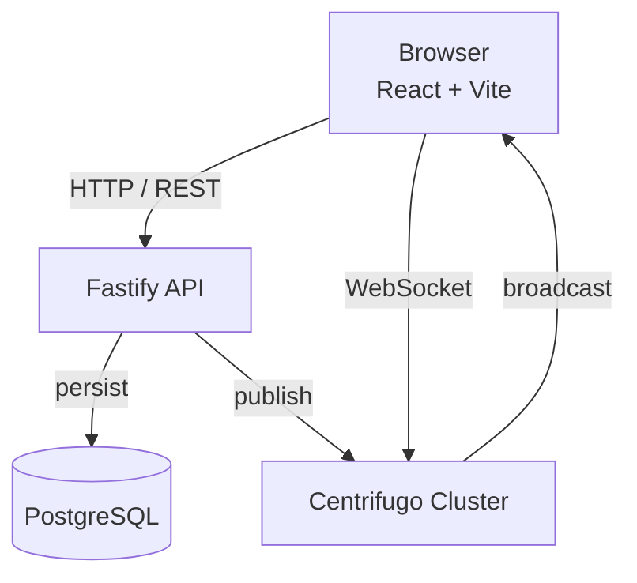
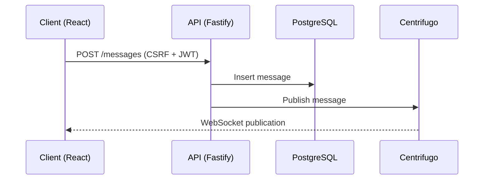
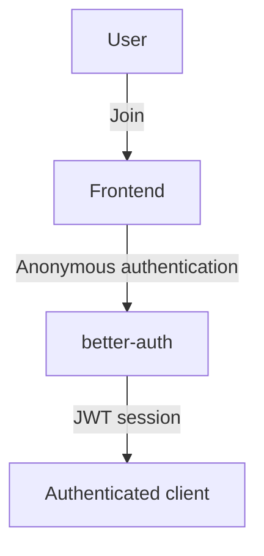
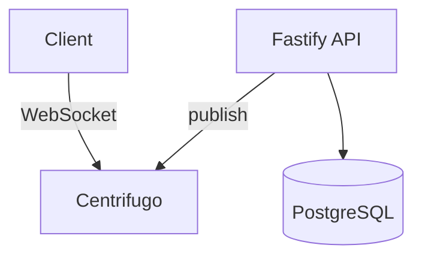
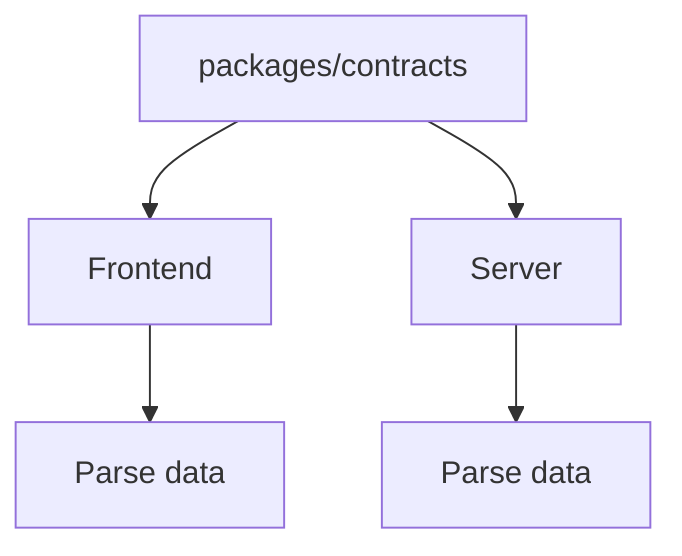

# Chat

Realtime anonymous group chat built on a pnpm monorepo with React, Fastify, PostgreSQL, and self-hosted Centrifugo.

## Overview

Chat is a single-channel anonymous group chat application. Users can join with one click, without creating an account, and exchange messages in real time.

The project explores **production-oriented realtime application architecture**, with an emphasis on:

* Self-hosted realtime delivery using Centrifugo
* End-to-end type-safe contracts shared between frontend and backend
* Anonymous authentication with CSRF-protected APIs
* PostgreSQL persistence
* Containerized local infrastructure
* A modular pnpm monorepo

At a high level, the API handles authentication, validation, and persistence while Centrifugo handles WebSocket connections and realtime message delivery.

---

## Tech Stack

| Layer          | Technology                       |
| -------------- | -------------------------------- |
| Frontend       | React 19, Vite 8, TypeScript 6   |
| Styling        | Tailwind CSS 4, Base UI          |
| Routing        | `@typeroute/router`              |
| API            | Fastify 5                        |
| Authentication | better-auth                      |
| Validation     | Zod, `fastify-type-provider-zod` |
| Realtime       | Centrifugo                       |
| Database       | PostgreSQL                       |
| ORM            | Drizzle ORM                      |
| Migrations     | drizzle-kit                      |
| Testing        | Vitest, Testing Library          |
| Code Quality   | Biome                            |
| Monorepo       | pnpm workspaces + catalog        |
| Infrastructure | Docker Compose, Caddy            |

---

## Architecture

The application is divided into four packages:



### Request and Realtime Flow



The application separates the request path from the realtime delivery path:

* **Fastify** handles authenticated HTTP requests, validation, and database persistence.
* **PostgreSQL** stores messages.
* **Centrifugo** manages WebSocket connections and broadcasts publications.
* **The frontend** communicates with Fastify over HTTP and Centrifugo over WebSocket.

This keeps WebSocket connection state outside the application server.

### Message Lifecycle



1. The client authenticates anonymously and obtains a session.
2. The client fetches a CSRF token and existing messages.
3. The client connects to Centrifugo over WebSocket.
4. A message is submitted to the Fastify API.
5. The API validates authentication and CSRF protection.
6. The message is persisted in PostgreSQL.
7. The API publishes the message to Centrifugo.
8. Centrifugo broadcasts the publication to subscribed clients.

Both the server and client validate realtime payloads against the same Zod schemas, keeping the wire format consistent.

### Persistence and Realtime Consistency

Message persistence and realtime delivery are separate operations.

The message is first persisted in PostgreSQL and then published to Centrifugo. This means a successful database write and a successful realtime publication are not one atomic operation.

If publication fails after persistence, the message remains in the database even though currently connected clients may not immediately receive the realtime event. Message history therefore remains the authoritative persisted state.

---

## Authentication

The application uses better-auth for anonymous authentication.

The authentication flow is intentionally designed to require no user registration:



Authenticated API requests are protected by:

* JWT-based sessions
* CSRF tokens
* Server-side authentication checks
* Request validation

The result is a zero-signup experience while retaining an authenticated API boundary.

---

## Realtime

Centrifugo handles WebSocket connections and message distribution.

The application server does **not** maintain individual WebSocket connections.



This allows the API to remain focused on HTTP requests and persistence while Centrifugo handles:

* WebSocket connection management
* Subscription management
* Connection lifecycle handling
* Broadcast logic
* Reconnection handling

The tradeoff is additional infrastructure and operational complexity.

---

## Shared Data Contracts

The project uses Zod as the shared contract definition.



Schemas live in `packages/contracts` and are consumed by both frontend and server.

This provides:

* A single source of truth for wire formats
* Runtime validation
* Shared TypeScript types
* Reduced API contract drift

Realtime message publications are validated on both sides using the same schema.

---

## Database

PostgreSQL is used for persistent message storage.

Drizzle ORM provides:

* Type-safe database queries
* Schema definitions
* Migration generation
* Migration execution

Database migrations are managed through `drizzle-kit`.

The database schema is committed to the repository so that the application can be reproduced consistently across environments.

---

## Repository Structure

```text
.
├── packages/
│   ├── contracts/
│   │   └── Shared Zod schemas and types
│   │
│   ├── frontend/
│   │   └── React + Vite SPA
│   │
│   ├── server/
│   │   └── Fastify API + Drizzle + better-auth
│   │
│   └── centrifugo/
│       └── Centrifugo HTTP publish client
│
├── configs/
│   ├── caddy/
│   │   └── Local reverse proxy configuration
│   │
│   └── centrifugo/
│       └── Centrifugo configuration
│
├── compose.yaml
├── pnpm-workspace.yaml
└── package.json
```

### Package Responsibilities

#### `packages/contracts`

The shared contract layer is the single source of truth for data exchanged between the frontend and backend.

It contains the Zod schemas and inferred TypeScript types used by both applications.

#### `packages/frontend`

The React SPA responsible for:

* Anonymous sign-in
* Authentication state
* Message history
* Chat UI
* Message submission
* Centrifugo WebSocket connection
* Realtime message handling

#### `packages/server`

The Fastify application responsible for:

* Authentication
* CSRF protection
* API routes
* Request validation
* Message persistence
* Database access
* Publishing messages to Centrifugo

#### `packages/centrifugo`

A thin abstraction over Centrifugo's HTTP publish API.

The server interacts with this package rather than making Centrifugo HTTP requests directly throughout the application.

---

## Local Development

### Prerequisites

* Node.js 24+
* pnpm
* Docker
* Docker Compose

### 1. Configure Environment

Copy the environment templates into place:

```bash
cp .env.example .env
cp packages/server/.env.example packages/server/.env
cp packages/frontend/.env.example packages/frontend/.env
```

Each environment file serves a different component:

| File                     | Used by        | Contains                                                             |
| ------------------------ | -------------- | -------------------------------------------------------------------- |
| `.env`                   | Docker Compose | PostgreSQL, better-auth, and Centrifugo infrastructure configuration |
| `packages/server/.env`   | Fastify API    | Database, Centrifugo, and server configuration                       |
| `packages/frontend/.env` | React frontend | API and WebSocket URLs                                               |

Generate secrets where required:

```bash
openssl rand -base64 32
```

The current development configuration expects `BETTER_AUTH_SECRET` and `CENTRIFUGO_API_KEY` to use the same generated value in both the root and server environment files.

### 2. Start Infrastructure

```bash
docker compose up -d
```

This starts:

* PostgreSQL
* Three Centrifugo nodes
* Caddy reverse proxy

### 3. Install Dependencies

```bash
pnpm install
```

### 4. Run Database Migrations

```bash
pnpm --filter server db:migrate
```

### 5. Start Development

```bash
pnpm dev
```

### Development Services

| Service    | URL                            |
| ---------- | ------------------------------ |
| Frontend   | `http://localhost:5173`        |
| API        | `http://localhost:3000`        |
| API health | `http://localhost:3000/health` |
| Centrifugo | `http://localhost:8080`        |

---

## Environment Variables

| File            | Variable              | Purpose                            |
| --------------- | --------------------- | ---------------------------------- |
| Root `.env`     | `POSTGRES_*`          | PostgreSQL Compose credentials     |
| Root `.env`     | `BETTER_AUTH_*`       | better-auth configuration          |
| Root `.env`     | `CENTRIFUGO_API_KEY`  | Server → Centrifugo authentication |
| Server `.env`   | `DATABASE_URL`        | PostgreSQL connection string       |
| Server `.env`   | `CENTRIFUGO_URL`      | Centrifugo API URL                 |
| Server `.env`   | `PORT`                | API port                           |
| Server `.env`   | `ADDRESS`             | API bind address                   |
| Server `.env`   | `SERVER_URL`          | Public API URL                     |
| Frontend `.env` | `VITE_SERVER_URL`     | API base URL                       |
| Frontend `.env` | `VITE_CENTRIFUGO_URL` | WebSocket URL                      |

---

## Testing

The project uses Vitest for both backend and frontend testing.

```bash
pnpm test
```

Run individual test suites:

```bash
pnpm test:server
pnpm test:frontend
```

### Server

The server suite contains 27 integration tests.

Tests use Fastify's `inject()` API and exercise the application through the HTTP layer, including:

* Authentication
* CSRF protection
* Request validation
* Pagination and contract shape
* Message persistence
* Realtime publishing

Repositories and Centrifugo are mocked via `vi.spyOn` where appropriate.

### Frontend

The frontend suite contains 17 unit/component tests.

Tests cover:

* Anonymous sign-in
* Authentication guards
* Chat rendering
* Message submission
* Realtime message reception
* Realtime publication handling

External dependencies such as the authentication client, Centrifuge client, toast notifications, and `fetch` are mocked where appropriate.

### Code Quality

Run all package linting:

```bash
pnpm lint
```

Or lint individual packages:

```bash
pnpm --filter frontend lint
pnpm --filter server lint
pnpm --filter centrifugo lint
pnpm --filter contracts lint
```

Biome is used for formatting and linting.

---

## Design Decisions

### Centrifugo over Socket.IO

Centrifugo was selected as the realtime infrastructure rather than implementing WebSocket handling directly inside Fastify.

**Advantages:**

* Dedicated realtime infrastructure
* Horizontal scaling support
* Connection management handled outside the API
* Built-in pub/sub capabilities
* Mature self-hosted solution

**Tradeoff:**

* Additional service to deploy and operate

### Anonymous Authentication

better-auth provides anonymous authentication while maintaining an authenticated API boundary.

**Advantages:**

* No registration flow
* Minimal friction for users
* JWT-based sessions
* CSRF protection
* Drizzle integration

**Tradeoff:**

* Anonymous users have no persistent identity or moderation profile

### Shared Zod Contracts

Schemas live in `packages/contracts` and are consumed by both frontend and server.

**Advantages:**

* Single source of truth
* Runtime validation
* Shared TypeScript types
* Reduced API contract drift

**Tradeoff:**

* Adds a shared package dependency between applications

### Drizzle ORM

Drizzle was selected for its lightweight TypeScript-first API and close mapping to SQL.

### `@typeroute/router`

The frontend uses `@typeroute/router` for type-safe navigation.

This allows route changes to surface compile-time errors rather than relying entirely on runtime route strings.

---

## Known Limitations

The implementation intentionally keeps the feature set small.

### Chat

* Single public channel
* All authenticated users see the same messages
* No message search
* No message editing
* No message deletion

### Identity

* No user registration
* No persistent user profiles
* Anonymous names are automatically generated
* No moderation interface

### Realtime Delivery

Database persistence and Centrifugo publication are separate operations.

A message can therefore be persisted successfully even if its realtime publication fails. Persisted message history remains the authoritative source of stored messages.

### TypeScript

better-auth's client currently resolves to `any` under TypeScript 6.

The application works around this limitation in tests by mocking the authentication client.

This is tracked as an upstream compatibility limitation.

---

## License

Apache-2.0
