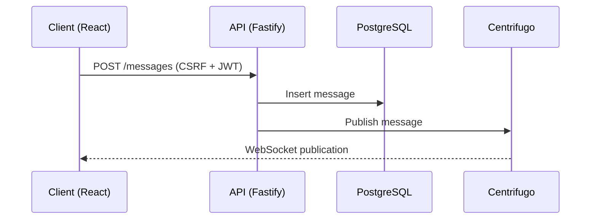
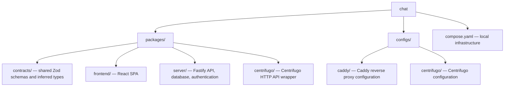
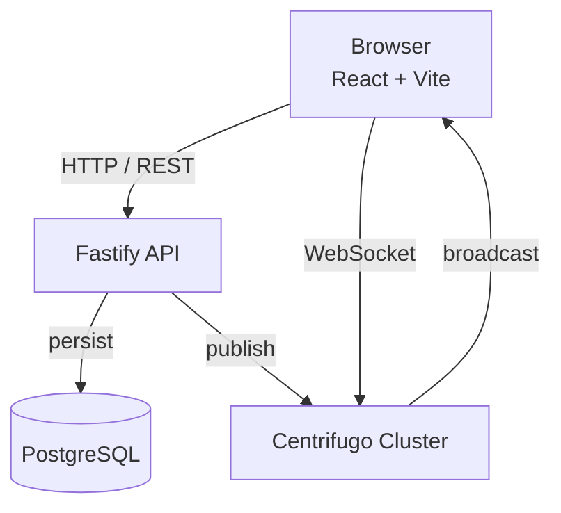
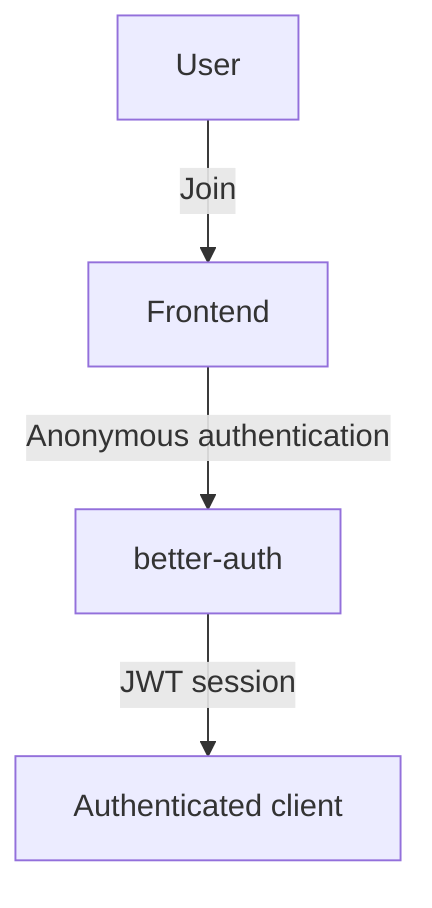
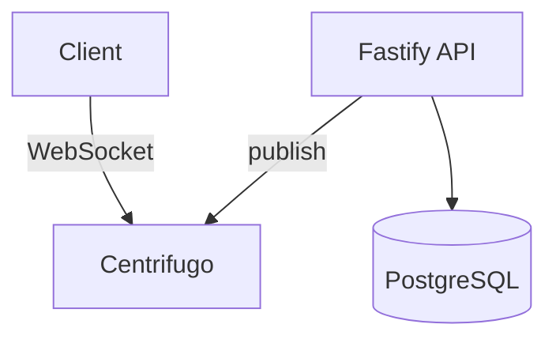
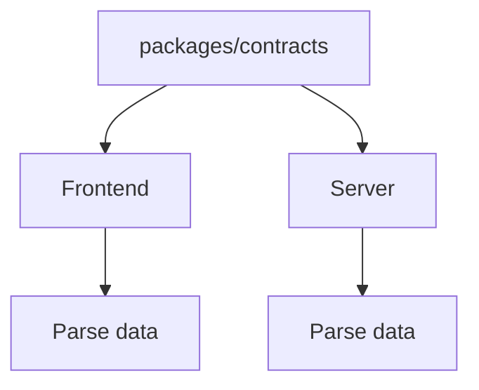

# Chat

Realtime anonymous group chat built on a pnpm monorepo with React, Fastify, PostgreSQL, and self-hosted Centrifugo.

## Overview

Chat is a single-channel anonymous group chat application. Users can join with one click, without creating an account, and exchange messages in real time.

The project is primarily an exploration of **production-grade realtime application architecture**, with an emphasis on:

* Self-hosted realtime delivery using Centrifugo
* End-to-end type-safe contracts shared between frontend and backend
* Anonymous authentication with CSRF-protected APIs
* PostgreSQL persistence
* Containerized local infrastructure
* A modular pnpm monorepo

### Core Flow



1. The client authenticates anonymously and obtains a session.
2. The client fetches a CSRF token and existing messages.
3. The client connects to Centrifugo over WebSocket.
4. A message is submitted to the Fastify API.
5. The API validates authentication and CSRF protection.
6. The message is persisted in PostgreSQL.
7. The API publishes the message to Centrifugo.
8. Centrifugo broadcasts the publication to subscribed clients.

Both the server and client validate realtime payloads against the same Zod schemas, keeping the wire format consistent.

---

## Architecture

The application is split into four main packages:



### Request and Realtime Paths



### Message Lifecycle

The API is responsible for **validation and persistence**.

Centrifugo is responsible for **realtime delivery**.

This keeps WebSocket connection management out of the application server and keeps WebSocket connection state away from the API.

---

## Tech Stack

| Layer          | Technology                       |
| -------------- | -------------------------------- |
| Frontend       | React 19, Vite 8, TypeScript 6   |
| Styling        | Tailwind CSS 4, Base UI          |
| Routing        | `@typeroute/router`              |
| API            | Fastify 5                        |
| Authentication | better-auth                      |
| Validation     | Zod, `fastify-type-provider-zod` |
| Realtime       | Centrifugo                       |
| Database       | PostgreSQL                       |
| ORM            | Drizzle ORM                      |
| Migrations     | drizzle-kit                      |
| Testing        | Vitest, Testing Library          |
| Code Quality   | Biome                            |
| Monorepo       | pnpm workspaces + catalog        |
| Infrastructure | Docker Compose, Caddy            |

---

## Authentication

The application uses better-auth for anonymous authentication.

The authentication flow is intentionally designed to require no user registration:



Authenticated API requests are protected by:

* JWT-based sessions
* CSRF tokens
* Server-side authentication checks
* Request validation

The result is a zero-signup experience while retaining an authenticated API boundary.

---

## Realtime Architecture

Centrifugo handles WebSocket connections and message distribution.

The application server does **not** maintain individual WebSocket connections.

Instead:



### Why Centrifugo?

Centrifugo provides the realtime connection and fan-out layer without requiring the application to implement:

* WebSocket connection management
* Subscription management
* Connection lifecycle handling
* Broadcast logic
* Reconnection handling

The tradeoff is additional infrastructure and operational complexity.

---

## Data and API Contracts

The project uses Zod as the shared contract definition.



This prevents the frontend and backend from independently defining the same payload structure.

For example, realtime message publications are validated on both sides using the same schema.

This provides a single source of truth for the application's wire format.

---

## Database

PostgreSQL is used for persistent message storage.

Drizzle ORM provides:

* Type-safe database queries
* Schema definitions
* Migration generation
* Migration execution

Database migrations are managed through `drizzle-kit`.

The database schema is committed to the repository so that the application can be reproduced consistently across environments.

---

## Local Development

### Prerequisites

* Node.js 24+
* pnpm
* Docker
* Docker Compose

### 1. Configure environment

```bash
cp .env.example .env
```

Generate secrets where required:

```bash
openssl rand -base64 32
```

### 2. Start infrastructure

```bash
docker compose up -d
```

This starts:

* PostgreSQL
* Three Centrifugo nodes
* Caddy reverse proxy

### 3. Install dependencies

```bash
pnpm install
```

### 4. Run database migrations

```bash
pnpm --filter server db:migrate
```

### 5. Start development

```bash
pnpm dev
```

### Development Services

| Service    | URL                            |
| ---------- | ------------------------------ |
| Frontend   | `http://localhost:5173`        |
| API        | `http://localhost:3000`        |
| API health | `http://localhost:3000/health` |
| Centrifugo | `http://localhost:8080`        |

---

## Environment Variables

| Variable              | Purpose                            |
| --------------------- | ---------------------------------- |
| `DATABASE_URL`        | PostgreSQL connection string       |
| `POSTGRES_*`          | PostgreSQL Compose credentials     |
| `BETTER_AUTH_SECRET`  | better-auth signing secret         |
| `BETTER_AUTH_URL`     | Public server URL                  |
| `CENTRIFUGO_API_KEY`  | Server → Centrifugo authentication |
| `VITE_SERVER_URL`     | Frontend API base URL              |
| `VITE_CENTRIFUGO_URL` | Frontend WebSocket URL             |

---

## Testing

The project uses Vitest for both backend and frontend testing.

```bash
pnpm test
```

Run individual test suites:

```bash
pnpm test:server
pnpm test:frontend
```

### Server

The server suite contains 27 integration tests.

Tests use Fastify's `inject()` API and exercise the application through the HTTP layer, including:

* Authentication
* CSRF protection
* Request validation
* Pagination and contract shape
* Message persistence and realtime publishing (repositories and Centrifugo are mocked via `vi.spyOn`)

### Frontend

The frontend suite contains 17 unit/component tests.

Tests cover:

* Anonymous sign-in
* Authentication guards
* Chat rendering
* Message submission
* Realtime message reception (publication handling)

External dependencies such as the authentication client, Centrifuge client, toast notifications, and `fetch` are mocked where appropriate.

### Code Quality

```bash
pnpm lint
```

Lint individual packages:

```bash
pnpm --filter frontend lint
pnpm --filter server lint
pnpm --filter centrifugo lint
pnpm --filter contracts lint
```

Biome is used for formatting and linting.

---

## Design Decisions

### Centrifugo over Socket.IO

Centrifugo was selected as the realtime infrastructure rather than implementing WebSocket handling directly inside Fastify.

**Advantages:**

* Dedicated realtime infrastructure
* Horizontal scaling support
* Connection management handled outside the API
* Built-in pub/sub capabilities
* Mature self-hosted solution

**Tradeoff:**

* Additional service to deploy and operate

---

### Anonymous Authentication

better-auth provides anonymous authentication while maintaining an authenticated API boundary.

**Advantages:**

* No registration flow
* Minimal friction for users
* JWT-based sessions
* CSRF protection
* Drizzle integration

**Tradeoff:**

* Anonymous users have no persistent identity or moderation profile

---

### Shared Zod Contracts

Schemas live in `packages/contracts` and are consumed by both frontend and server.

**Advantages:**

* Single source of truth
* Runtime validation
* Shared TypeScript types
* Reduced API contract drift

**Tradeoff:**

* Adds a shared package dependency between applications

---

### Drizzle ORM

Drizzle was selected for its lightweight TypeScript-first API and close mapping to SQL.

The project currently uses `1.0.0-rc.4` for its v1 API.

The stable `0.45.x` line remains a drop-in alternative if a stable release is preferred.

---

### `@typeroute/router`

The frontend uses `@typeroute/router` for type-safe navigation.

This allows route changes to surface compile-time errors rather than relying entirely on runtime route strings.

---

## Known Limitations

The current implementation intentionally keeps the feature set small.

### Chat

* Single public channel
* All authenticated users see the same messages
* No message search
* No message editing
* No message deletion

### Identity

* No user registration
* No persistent user profiles
* Anonymous names are automatically generated
* No moderation interface

### TypeScript

better-auth's client currently resolves to `any` under TypeScript 6.

The application works around this limitation in tests by mocking the authentication client.

This is tracked as an upstream compatibility limitation.

---

## License

MIT
